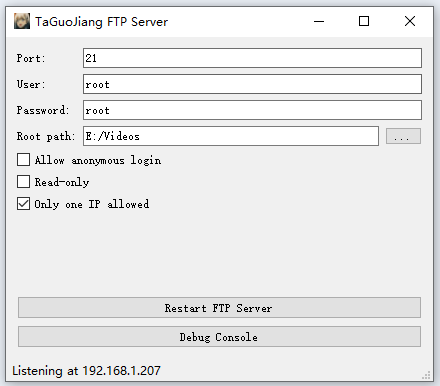

# 基于Qt的FTP Server

## 环境依赖
### windows
我的开发环境
- VS2022
- Qt5.12.9 
- 解决方案x64  

## UI


## 测试
chrome等浏览器已不支持FTP

### 1. 使用windows资源管理器
```
ftp://IP[:PORT]
```
注意：资源管理器存在缓存，当FTP server切换根目录，资源管理器还是显示原来的根目录，这时候要右键刷新。

### 2. 使用cmd ftp命令

``` shell
// 默认端口21连接
ftp IP

// 非默认端口连接
ftp
open IP [PORT]
```

| 命令 | 说明 |
| :--: | :--: |
| help, help COMMAND | 显示所有命令, 显示命令的帮助信息 |
| open IP PORT | 连接到FTP服务器 |
| ls | 列出服务器当前目录内容，仅显示文件名 |
| LS | 列出服务器当前目录内容 |
| send FILE | 上传文件 |
| recv FILE | 下载文件 |
| lcd | 显示本地工作目录 |
| pwd | 显示FTP服务器工作目录 |

### 3. 使用FileZilla

## 参考
https://github.com/sashoalm/QFtpServer