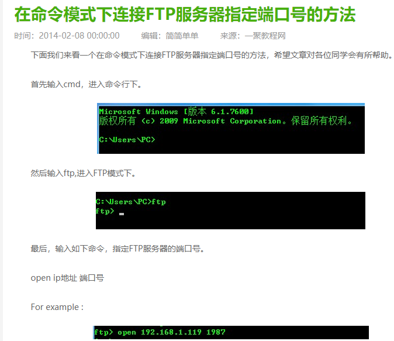

# 基于Qt的FTP Server

## 环境依赖
### windows
我的开发环境
- VS2022
- Qt5.12.9 
- 解决方案x64  

## UI


## 测试
chrome等浏览器已不支持FTP
### 1. 使用cmd ftp命令测试


### 2. 使用资源管理器访问
```
ftp://192.168.2.107:21
```

## 参考
https://github.com/sashoalm/QFtpServer